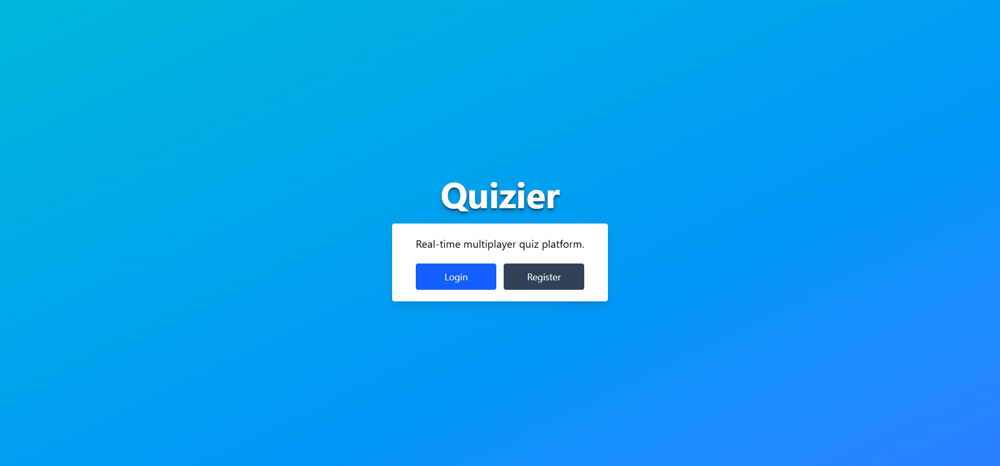
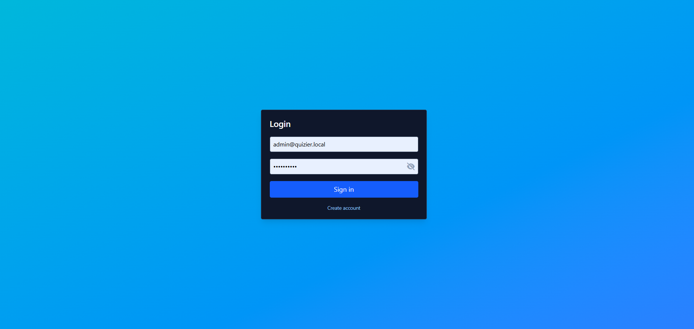
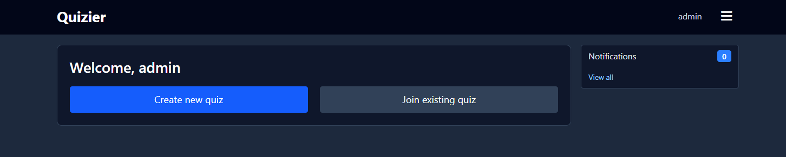
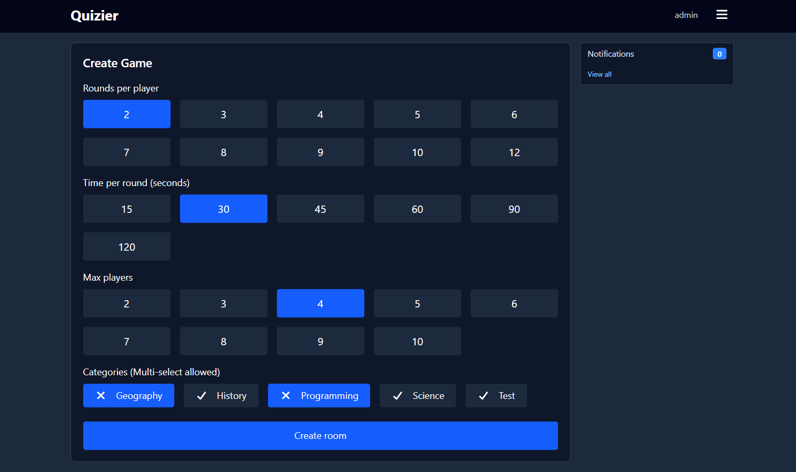
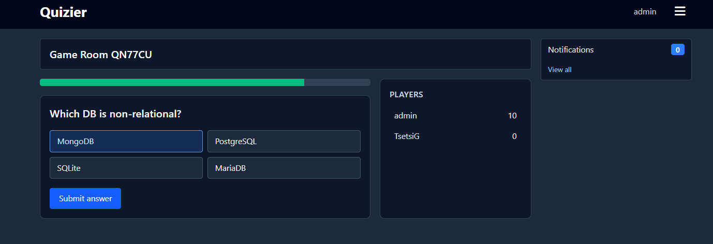
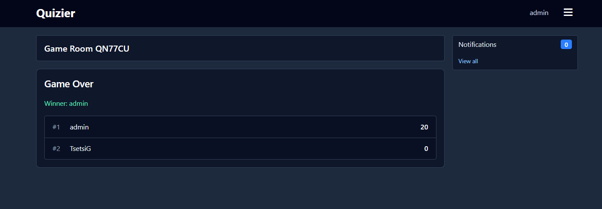
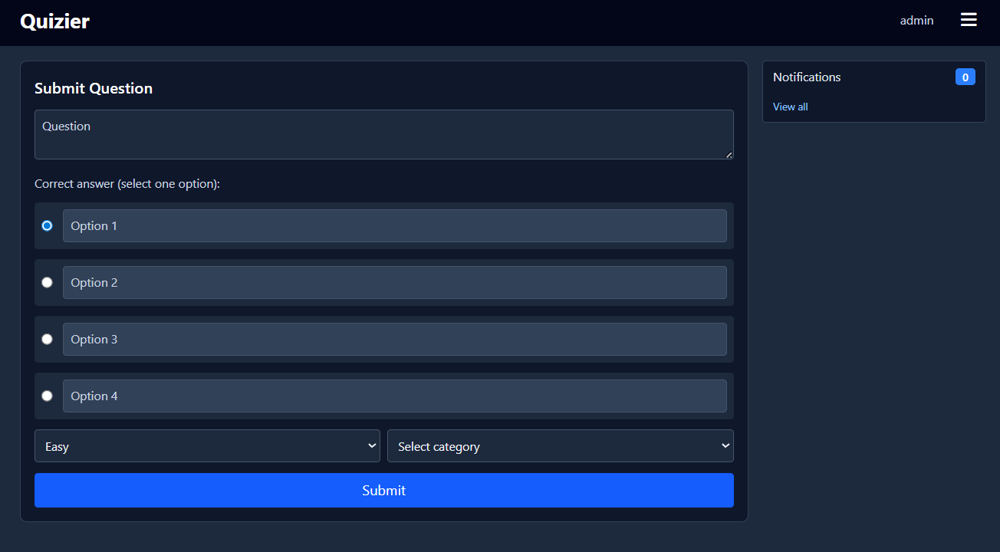
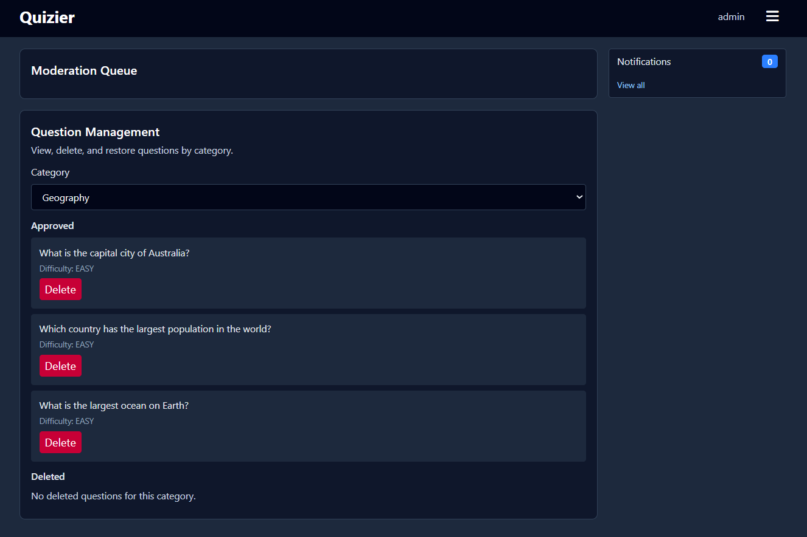
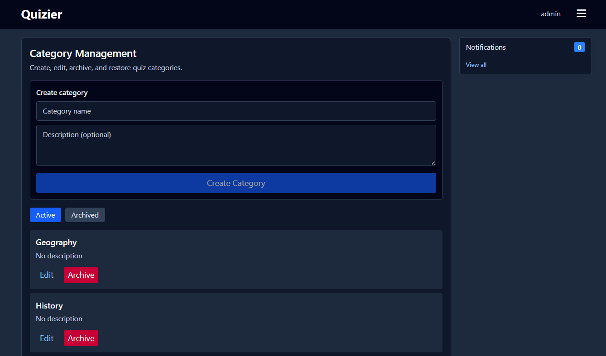

# Quizier Monorepo

Nx monorepo scaffold for Quizier:

- `packages/server` — Fastify + TypeScript backend
- `packages/client` — React 19 + Vite + Tailwind frontend
- `packages/shared` — Shared TypeScript and Zod contracts

## Overview

Quizier is a real-time multiplayer quiz game. An admin (or host) manages categories and questions, players join a room, and the game runs live with timed questions and a scoreboard.

Main features:

- Real-time game sessions (rooms) over WebSockets
- Player join flow + live game board + timer
- Leaderboards / player stats
- Admin area for managing categories/questions
- Question submissions + moderation queue
- In-app notifications

## Prerequisites

- Node.js 20+
- npm 9+
- Docker (for MongoDB)

## First-time Setup

```bash
npm install
cp .env.example .env
docker compose up -d

# Seed initial data
npm run seed:admin
npm run seed:example
```

## Development

```bash
# Run client + server together
npm run dev

# Or run them separately
npm run dev:server
npm run dev:client
```

## Default Admin User (Local)

When you run `npm run seed:admin`, the admin user is created/updated using the values from your `.env`.

Example credentials (from `.env.example`):

- Email: `admin@quizier.local`
- Password: `1234567Asd`

## Different screen images









### Admin only screens



